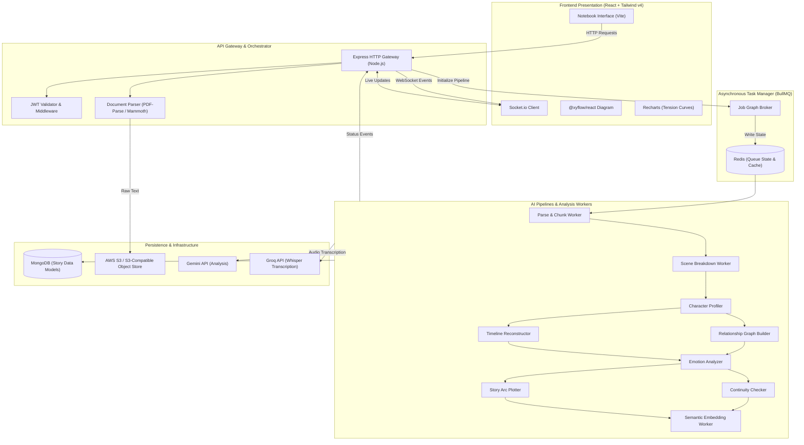
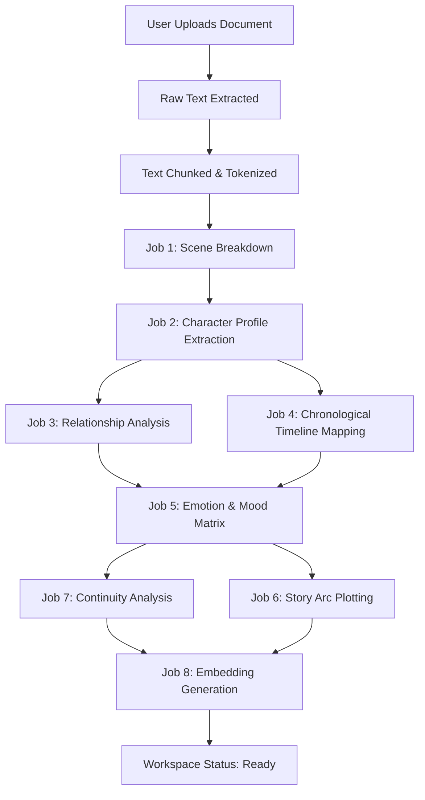
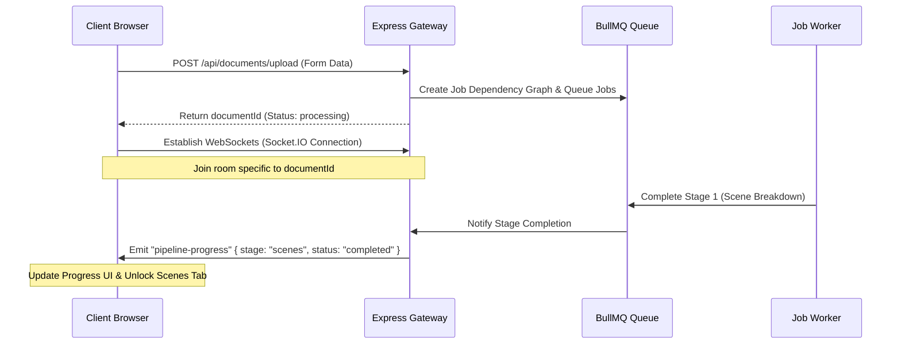

# SceneCraft — AI-Powered Interactive Story Analysis Platform

> **Not just a summary.** SceneCraft is a job-oriented, multi-service platform that transforms any uploaded narrative manuscript (PDF, DOCX, or TXT) into a structured, fully explorable, interactive workspace with live WebSocket progress tracking and semantic search.

[](https://github.com)
[](https://github.com)
[](https://github.com)

---

## 📋 Table of Contents
- [Overview](#-overview)
- [Screenshot](#-screenshot)
- [What Makes SceneCraft Different](#-what-makes-scenecraft-different)
- [Core Features & Modules](#-core-features--modules)
- [System Architecture](#-system-architecture)
- [Tech Stack](#-tech-stack)
- [Project Directory Structure](#-project-directory-structure)
- [Core Data Pipelines & Lifecycles](#-core-data-pipelines--lifecycles)
- [Environment Variables](#-environment-variables)
- [Installation & Setup](#-installation--setup)
- [Design Patterns Used](#-design-patterns-used)
- [License](#-license)

---

## 🌟 Overview

SceneCraft converts raw creative drafts into rich, interactive metadata. Rather than relying on a flat, disposable chatbot response, SceneCraft utilizes a **9-stage dependency-aware AI analysis pipeline** powered by **Gemini API** and **Groq SDK** to parse structural, narrative, character, relationship, and emotional details.

All results are stored in a cross-referenced NoSQL database and served through a minimal, paper-inspired notebook interface featuring interactive relationship node graphs, chronologically-reordered timelines, narrative tension charts, and semantic query lookup.

---

## 📸 Screenshot

Here is a preview of the SceneCraft interactive workspace:


---

## What Makes SceneCraft Different

These are the engineering highlights that separate SceneCraft from simple single-prompt wrapper projects:

| Feature | Implementation |
|---|---|
| ⛓️ **Dependency-Aware Job Graph** | BullMQ + Redis task management scheduling dependent analysis stages sequentially (e.g. mapping relationships *after* character profiles are extracted) |
| 📊 **Real-Time Stage Streaming** | Socket.io progress updates that stream status updates of the processing pipeline directly to the client as jobs complete |
| 🕸️ **Interactive Node Graphs** | React Flow (`@xyflow/react`) canvas rendering characters as nodes and relationships as edges with custom weight and sentiment indicators |
| 🔍 **Semantic Story Memory** | Text embeddings generated and queried via vector representation for natural language queries |
| 📈 **Tension & Pacing Mapping** | Custom algorithm analyzing conflict indicators and scene lengths, visualized using interactive Recharts curves |
| 🕵️ **Continuity Auditor** | Multi-pass LLM scanner detecting plot holes, timeline inconsistencies, and character attribute mismatches |
| 🎙️ **Voice-to-Text Integration** | Groq Whisper Large-v3 backend pipeline for voice-driven note-taking and navigation |
| 📂 **Format-Flexible Parser** | Streamlined server-side parser extracting structural elements from `.docx`, `.pdf`, and `.txt` files |

---

## ✨ Core Features & Modules

### 1. Scene Breakdown
- **Automatic Segmentation**: Identifies scene boundaries from structural, narrative, and setting cues.
- **Location & Cast Tagging**: Tags settings and present characters on a scene-by-scene basis.
- **Original Source Links**: Saves text range offsets, enabling users to click a scene card and scroll directly to that page.

### 2. Character Profiles
- **Entity Resolution**: Automatically deduplicates names and nicknames (e.g. merging "Alex" and "Alexander") into single identity records.
- **Dynamic Traits**: Lists personality descriptors, role classifications (Protagonist, Antagonist, Supporting), and tracks appearance records.

### 3. Relationship Graph
- **Network Diagrams**: Shows character proximity, ally/rival status, and sentiment weight.
- **Temporal Sentiment Tracking**: Stores sentiment score changes per scene, allowing users to watch connections evolve or decay over the story's timeline.

### 4. Story Timeline
- **Dual Axis Ordering**: Users can toggle between **Narrative Order** (the order events are read) and **Chronological Order** (the actual timeline order, highlighting flashbacks and flash-forwards).
- **Time Marker Parsing**: Resolves temporal references (e.g. "Three years later" or "the following autumn").

### 5. Mood & Emotion Analysis
- **Intensity Matrix**: Evaluates narration and dialogue tone per scene to score primary emotions (grief, joy, tension, fear).
- **Color Shaded Grid**: Shades scene cards dynamically on soft pastel gradients representing emotional intensity.

### 6. Story Arc Chart
- **Tension Curve**: Plots emotional intensity and conflict scores to trace narrative build-up.
- **Climax Detection**: Automatically flags peak tension coordinates and overlays benchmark narrative curves (Three-Act, Hero's Journey).

### 7. Continuity Checker
- **Audit Logging**: Flags inconsistent attributes (e.g. eye color changing from blue to green) or impossible movements (a character appearing in two locations simultaneously).
- **Triage Dashboard**: Ranks issues by severity (High, Medium, Low) allowing creators to dismiss or mark issues as resolved.

---

## 🏗️ System Architecture



---

## 🛠️ Tech Stack

### Backend
- **Node.js**: Runtime environment.
- **Express.js**: HTTP server.
- **MongoDB + Mongoose**: Primary document database.
- **Redis (ioredis)**: State management for BullMQ queues and temporary rate-limit storage.
- **BullMQ**: Dependency-aware background job processor.
- **@google/generative-ai**: Underpinning LLM services (Gemini).
- **groq-sdk**: High-performance audio transcription (Whisper Large-v3).
- **pdf-parse & mammoth**: Server-side raw text extractions from PDF and DOCX.
- **AWS SDK (S3)**: File storage for original manuscripts.

### Frontend
- **React 19 + Vite**: High-performance client framework.
- **Tailwind CSS v4**: Utility-first styling.
- **Framer Motion**: Page-flip transition states and loading visual sequences.
- **@xyflow/react**: Interactive relationship network graphs.
- **Recharts**: Responsive charting for tension and pacing curves.
- **Socket.io Client**: Real-time progress updates.

---

## 📁 Project Directory Structure

```
SceneCraft/
├── backend/
│   ├── src/
│   │   ├── config/          # Redis, MongoDB, AWS S3, and AI Provider initializers
│   │   ├── controllers/     # HTTP endpoint handlers
│   │   ├── middlewares/     # JWT Auth guards, rate limiting, and global error handlers
│   │   ├── models/          # Schemas (User, Document, Scene, Character, Relationship, etc.)
│   │   ├── queues/          # BullMQ queue creators and job graph handlers
│   │   ├── routes/          # Express Router declarations
│   │   ├── services/        # AI prompt generators and processing logic
│   │   ├── utils/           # Text chunkers and app helpers
│   │   ├── workers/         # BullMQ processing consumers (parsing, scenes, characters)
│   │   ├── app.js           # Express app lifecycle setup
│   │   └── server.js        # Entry server listener and Socket.io bootstrap
├── frontend/
│   ├── src/
│   │   ├── assets/          # Static layout elements
│   │   ├── components/      # UI components (SearchTab, StoryArcTab, Loader, Navigation)
│   │   ├── contexts/        # React Global contexts (Auth, Socket)
│   │   ├── hooks/           # Custom API fetching and websocket wrappers
│   │   ├── layouts/         # Frame layouts
│   │   ├── pages/           # Views (Dashboard, Notebook Workspace, Characters, Relations)
│   │   ├── App.jsx          # Route paths
│   │   └── main.jsx         # Vite bootstrapping
```

---

## 🔄 Core Data Pipelines & Lifecycles

### 1. Document Processing & Dependency Graph


### 2. Live Pipeline Progress Streaming


---

## 🔑 Environment Variables

Create a `.env` file inside `backend/`:

```env
NODE_ENV=development
PORT=5000
MONGO_URI=mongodb://localhost:27017/scenecraft
REDIS_URL=redis://127.0.0.1:6379

JWT_SECRET=your_jwt_secret_key
JWT_EXPIRY=24h

GEMINI_API_KEY=your_gemini_api_key
GROQ_API_KEY=your_groq_api_key

AWS_ACCESS_KEY_ID=your_aws_key
AWS_SECRET_ACCESS_KEY=your_aws_secret
AWS_S3_BUCKET_NAME=scenecraft-manuscripts
AWS_REGION=us-east-1
```

Create a `.env` file inside `frontend/`:

```env
VITE_API_URL=http://localhost:5000/api
VITE_WS_URL=http://localhost:5000
```

---

## ⚡ Installation & Setup

### Prerequisites
- Node.js (v18.0.0 or higher)
- MongoDB instance running locally or on Atlas
- Redis server active (port 6379)

### 1. Clone & Install
```bash
git clone https://github.com/yourusername/SceneCraft.git
cd SceneCraft

# Install backend dependencies
cd backend && npm install

# Install frontend dependencies
cd ../frontend && npm install
```

### 2. Start Services
```bash
# In backend/ directory
npm run dev

# In frontend/ directory
npm run dev
```
Open `http://localhost:5173` in your browser.

---

## 🧠 Design Patterns Used

- **Pipeline / Job Graph Pattern**: Splitting LLM queries into chronological dependent stages to build reliable, structured knowledge representation.
- **Pub/Sub Event Pattern**: Communicating status updates across Workers, HTTP Servers, and client screens using Redis and Socket.io.
- **Factory & Strategy Pattern**: Dynamically choosing parser wrappers based on file MIME types (`pdf`, `docx`, `txt`).

---

## 📜 License

Distributed under the **MIT License**. See `LICENSE` for details.
